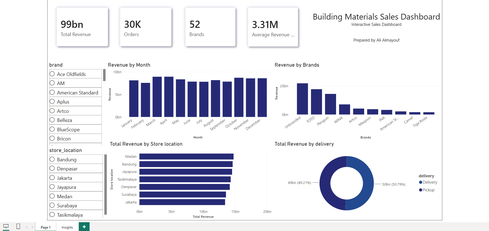

# 📊 Building Materials Sales Analysis

An end-to-end Data Analytics project using **Python** and **Power BI**.

---

## 📷 Dashboard Preview



---

## 📌 Project Overview

This project analyzes building materials sales data using Python and Power BI to uncover business insights, visualize sales performance, and support data-driven decision-making.

---

## 🛠 Tools & Technologies

- Python
- Pandas
- NumPy
- Matplotlib
- Seaborn
- Power BI

---

## 📂 Project Structure

```
building-materials-sales-analysis
│
├── data
│   └── building_supply_store_sales_cleaned.csv
│
├── src
│   └── sales_analysis.py
│
├── dashboard
│   └── Building_Materials_Dashboard.pbix
│
├── images
│   └── dashboard.png
│
├── README.md
├── requirements.txt
└── LICENSE
```

---

## 📊 Dashboard Features

- Revenue Overview
- Monthly Sales Trend
- Brand Performance
- Store Performance
- Delivery Analysis
- KPI Cards

---

## 📈 Business Insights

- Revenue remained relatively stable throughout the year.
- March, April, October, November, and December recorded slightly higher sales.
- Unbranded products generated the highest revenue.
- Delivery and Pickup sales were almost equally distributed.
- Medan, Bandung, and Jayapura recorded the highest total revenue.

---

## 🚀 Future Improvements

- Predictive Sales Forecasting
- Customer Segmentation
- Interactive Time Filters
- Advanced KPI Analysis

---

## 👨‍💻 Author

**Ali Almayouf**

Data Science Student

Python • SQL • Power BI
